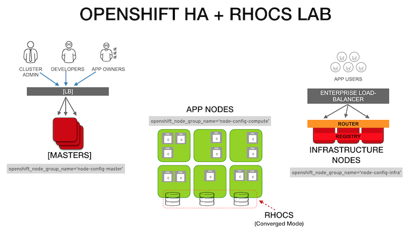

# ABOUT THIS REPO
This repository is a **prescriptive** OpenShift _inventory_ file I for my lab environment and some notes on the installation process. The inventory file is verbose to allow for quick adjustment during tests. 

To customize the inventory file to your environment you may reference the official OpenShift documentation:

https://docs.openshift.com/container-platform/3.11/install/configuring_inventory_file.html


# LAB CONCEPTUAL DIAGRAM




- The [LB] represents a dedicated RHEL minimal server OpenShift can configure to serve as the load balancer for the Master Nodes. In a production environment this may be replaced by load balancer configured in passthrough mode.

# ENVIRONMENT REQUIREMENTS
1. Ensure DNS resolution of all nodes FQDN
2. Register the FQDN for the cluster consoles like ocp-console.example.com (``openshift_master_cluster_hostname``)
3. Register the wildcard subdomain for the apps like *.apps.example.com (``openshift_master_default_subdomain``)
4. Ensure SELinux in ``enforcing`` mode

# HOST PREPARATION

***NOTE 1:*** This is only a summary. For detailed information visit:
https://docs.openshift.com/container-platform/latest/install/host_preparation.html

***NOTE 2:*** The following instructions assume the use of a _bastion_ node to deploy OpenShift

1. Ensure _bastion_ node has ssh access to all nodes
```
$ ssh-keygen

$ for host in master1.example.com \
master2.example.com \
master3.example.com \
infranode1.example.com \
infranode2.example.com \
node1.example.com \
node4.example.com \
node3.example.com \
ocs-node1.example.com \
ocs-node2.example.com \
ocs-node3.example.com; \
do ssh-copy-id -i ~/.ssh/id_rsa.pub $host; \
done
```

2. Register the host

```
# register each host with RHSM
subscription-manager register --username=<user_name> --password=<password>

# pull subscriptions
subscription-manager refresh

# identify the available OpenShift subscriptions
subscription-manager list --available --matches '*OpenShift*'

# assign a subscription to the node
subscription-manager attach --pool=<pool_id>
```

3. Assign subscription to the host

```
# Disable all RHSM repositories
subscription-manager repos --disable="*"

# Enable only repositories required by OpenShift
subscription-manager repos \
    --enable="rhel-7-server-rpms" \
    --enable="rhel-7-server-extras-rpms" \
    --enable="rhel-7-server-ose-3.11-rpms" \
    --enable="rhel-7-server-ansible-2.6-rpms"
```

4. Make sure the systems have the latest patches
```
# Update RHEL
yum -y update

# Reboot with updated Kernel
reboot
```

# INSTALLING OPENSHIFT
1. Install required installation tools at _bastion_ node
```
$ yum -y install atomic-openshift-clients openshift-ansible
```

2. Prepare your custom _inventory_ file. (See reference [template](inventory-host-TEMPLATE.yaml) in this repo)
   
3. Copy your OpenShift Ansible _inventory_ file to the _bastion_ node. Either using the _bastion_ Ansible host file or maintaining a local _inventory_file_
```
/etc/ansible/hosts

_or_

~/inventory_file

```

- Inventory configuration details: https://docs.openshift.com/container-platform/3.11/install/configuring_inventory_file.html


4. Validate _bastion_ can reach all the nodes 

```
ansible all -i inventory_file -m ping
```

5. From _bastion_ node run the installation of prerequisites (base packages & Docker) on all OpenShift nodes

 ```
ansible-playbook -f 20 -i inventory_file /usr/share/ansible/openshift-ansible/playbooks/prerequisites.yml
```

***NOTE***: In case of error indicating playbooks are not found, install the corresponding package in the _bastion_ node executing: ```yum install openshift-ansible```

***NOTE***: The ``-i <inventory_file>`` flag is not needed if using the default inventory path ``/etc/ansible/hosts``

6. Once the previous step is completed ***WITHOUT*** any error, you may proceed with the deployment.

    Deploy OpenShift using the ``ansilbe-playbook``

```
ansible-playbook -f 20 -i inventory_file /usr/share/ansible/openshift-ansible/playbooks/deploy_cluster.yml
```

NOTE: If the initial installation fails you need to uninstall OpenShift and start the installation from the _prerequisites_ playbook.

# UNINSTALLING OPENSHIFT

```
# Uninstall OpenShift
ansible-playbook -i inventory_file /usr/share/ansible/openshift-ansible/playbooks/adhoc/uninstall.yml

# Remove leftover configs and certs from master and nodes
ansible nodes -i inventory_file -m file -a "dest=/etc/origin state=absent"
ansible nodes -i inventory_file -m file -a "dest=/etc/cni state=absent"
```

## (optional) Reset `iptables` config after CNI failed installations
Under certain installation failure scenarios (specially with network plugins) there might be some `iptables` entries left behind. To reset these you should have a clean iptables backup. 

***NOTE:*** The following is a sample `iptables.plain` from VMs running in a *RHV* environment: 

```
# filename: iptables.plain
# sample configuration for iptables service
*filter
:INPUT ACCEPT [0:0]
:FORWARD ACCEPT [0:0]
:OUTPUT ACCEPT [0:0]
-A INPUT -m state --state RELATED,ESTABLISHED -j ACCEPT
-A INPUT -p icmp -j ACCEPT
-A INPUT -i lo -j ACCEPT
-A INPUT -p udp -m multiport --dports 60001:60005 -j ACCEPT
-A INPUT -p tcp -m state --state NEW -m tcp --dport 22 -j ACCEPT
-A INPUT -j REJECT --reject-with icmp-host-prohibited
-A FORWARD -j REJECT --reject-with icmp-host-prohibited
COMMIT
```

To restore this `iptables` config to all the nodes use:
```
ansible nodes -i inventory_file -m copy -a "src=./iptables.plain dest=/etc/sysconfig/iptables"
```

Restart `iptables` service. Some CNI plugin installation failures might require a `reboot` of the node.


# UNINSTALLING RHOCS
```
# Uninstall OCS
ansible-playbook -i <path_to_inventory_file> /usr/share/ansible/openshift-ansible/playbooks/openshift-glusterfs/uninstall.yml

# Uninstall OCS deleting data
ansible-playbook -i <path_to_inventory_file> -e "openshift_storage_glusterfs_wipe=true" /usr/share/ansible/openshift-ansible/playbooks/openshift-glusterfs/uninstall.yml

# Cleaning OCS leftovers
ansible -i inventory_file glusterfs -a "rm -rf /var/lib/heketi /etc/glusterfs  /var/lib/glusterd /var/log/glusterfs"

# Clean partitions of OCS target disks
ansible -i inventory_file glusterfs -a "wipefs -a -f /dev/<path_to_disks>"

```

# TESTING THE OPENSHIFT INSTALLATION
## Setting up _bastion_ node for ``system:admin`` access
To use the _bastion_ node for cluster administration, copy the .kube directory from _master1_ to your _bastion_

```
ansible -i inventory_file masters[0] -b -m fetch -a "src=/root/.kube/config dest=/root/.kube/config flat=yes"
```

Once the .kube directory is in your _bastion_ node, validate you are ``system:admin``

```
oc whoami
```

## Verifying the environment
The following commands you be successful

```
oc get nodes --show-labels

oc get nodes -o wide

oc get pod --all-namespaces -o wide

oc login -u <ocp_user>
```

Login into the web console by accessing the name indicated in the ``openshift_master_cluster_hostname`` variable of the _inventory_file_ (i.e. https://openshift-console.example.com)

Try some demo applications to test the environment.

I have some simple demo activities here: https://github.com/williamcaban/podcool-docs

# Custom Certificates

Deploying custom certificates are not part of this lab documentation. If need to use custom certificates refer to the following documentation

- Configuring Custom Certificates

  https://docs.openshift.com/container-platform/3.11/install_config/certificate_customization.html

- Redeploying Certificates

  https://docs.openshift.com/container-platform/3.11/install_config/redeploying_certificates.html

- To deploy OpenShift named certificates

  https://gist.github.com/abutcher/2e13e963a6c241cc5e90
